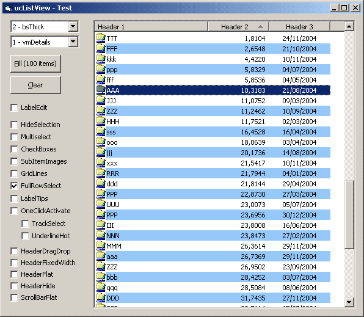



## API\-ucListView 1\.0

### Description

API-ListView usercontrol with most commom features (no dependencies -&gt; thanks to Paul Caton for his great self-subclassing usercontrol template [CodeId=54117]). 

----

Notice: 1) Column, item and imagelist-icon indexing is zero-based. 2) Sorting: user should create a 'private' array for storing current column sort order (Ascending/Descending: 1/-1) -&gt; Switch between sort order. 3) Items/SubItems do not allow custom font appearance (Bold, Color, etc). -&gt; This needs custom-draw routines. 4) All properties are 'run-time properties'. 

----

Update 09/07: Added basic custom-draw support (for [Details] mode). Now, you can easily create a highlight effect (row and/or column). Enable RaiseSubItemPrePaint() and respond to OnSubItemPrePaint() event. 

----

Update 09/08: Custom-draw fix. Crash when XP theme enabled (Thanks to Dana Seaman). 

----

Update 12/09: Second and last fix for XP. 

----

Compatibility: in principle, all systems. // 33Kb zip.
 
### More Info
 

             |
---                |---
**Submitted On**   |2005-05-04 13:13:48
**By**             |[Carles P\.V\.](https://github.com/Planet-Source-Code/PSCIndex/blob/master/ByAuthor/carles-p-v.md)
**Level**          |Intermediate
**User Rating**    |4.9 (148 globes from 30 users)
**Compatibility**  |VB 6\.0
**Category**       |[Custom Controls/ Forms/  Menus](https://github.com/Planet-Source-Code/PSCIndex/blob/master/ByCategory/custom-controls-forms-menus__1-4.md)
**World**          |[Visual Basic](https://github.com/Planet-Source-Code/PSCIndex/blob/master/ByWorld/visual-basic.md)
**Archive File**   |[API\-ucList1887915132005\.zip](https://github.com/Planet-Source-Code/carles-p-v-api-uclistview-1-0__1-56021/archive/master.zip)

